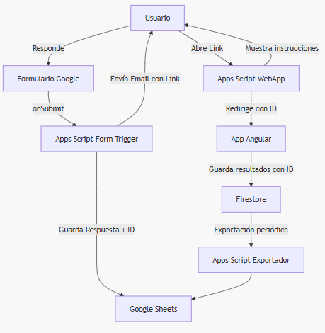

<div align="center" width="100%">
  <a href="https://investigar.com.ar" target="_blank">
    
  </a>
</div>

# Investig.ar

[Investig.ar](investigar.com.ar) es una plataforma _web_ de investigación cuyo objetivo es evaluar diversos procesos cognitivos en la sociedad argentina. Surgida en el contexto de la pandemia de COVID-19, Investig.ar permite a los científicos recopilar datos de manera eficiente, precisa y a gran escala en poco tiempo.

La aplicación está desarrollada con [Angular](https://angular.io/) en el _front-end_ y utiliza [Firebase](https://firebase.google.com/) en el _back-end_ para autenticación, almacenamiento y base de datos en tiempo real. La plataforma ofrece a los usuarios una serie de _tests_ cognitivos interactivos (actualmente Creatividad y RULIT) cuyos resultados se almacenan para análisis posteriores.

Cada _test_ está integrado en la aplicación como un módulo separado, lo que permite encapsular su lógica y componentes. Investig.ar busca ser modular, escalable y mantenible, cumpliendo principios de separación de responsabilidades y bajo acoplamiento entre componentes.

## Arquitectura de la aplicación

La arquitectura de Investig.ar sigue una estructura **multicapa** típica de aplicaciones Angular modernas, apoyada en servicios de Firebase como _backend_. A alto nivel, el flujo es el siguiente:

**Frontend (Angular)**: Implementado en Angular (versión ~20) con componentes modulares y diseño responsivo usando Angular Material y SCSS. El _frontend_ maneja toda la interacción de usuario.

**Servicios Angular**: Capa intermedia en el _front-end_ que encapsula la lógica de negocio específica de cada _test_ y funciones comunes. Los servicios se comunican con Firebase mediante el SDK proporcionado.

**Backend (Firebase)**: Provee autenticación de usuarios (p. ej. para acceso de administradores), base de datos en tiempo real (Firestore) para persistir resultados, y almacenamiento de archivos si es necesario. Las reglas de seguridad de Firestore están configuradas para restringir el acceso a los datos según el usuario y su rol (por ejemplo, cada usuario solo puede leer/escribir sus propios resultados de test).

En términos de interacción, el usuario utiliza la aplicación Angular en el navegador, la cual se comunica mediante el SDK de Firebase con la base de datos y servicios de autenticación. Esta relación se ilustra en el siguiente diagrama de arquitectura.


<!--
graph TD;
    Usuario |Browser| Angular[App Angular];
    Angular |API| Firebase[Firebase: Auth, Firestore];
    Angular |Servicios| Servicios[Servicios y Módulos];
    Angular |UI| Componentes[Componentes y Vistas];
    Servicios |Datos| FirestoreDB[Firestore DB];
    Servicios |Auth| Auth[Autenticación];
-->

**Diagrama 1:** Arquitectura general, mostrando la interacción Usuario → Angular (_frontend_) → Firebase (_backend_).

Como se ve, la capa de presentación (Angular) contiene los **componentes** y **vistas** con los que interactúa el usuario, organizados en distintos módulos funcionales.

Estos componentes consumen **Servicios Angular** (proveídos vía _inyección de dependencias_), los cuales encapsulan la lógica de negocio y operaciones como lecto-escritura en la base de datos.

Los servicios utilizan el SDK de Firebase para comunicarse con Firestore (base de datos NoSQL) y Auth (autenticación de usuarios). Este diseño sigue patrones recomendados: por ejemplo, se usan componentes “smart” y “dumb”, **Reactive Forms** para manejo de formularios, **Observables** para gestión reactiva de datos, etc., manteniendo la lógica desacoplada de la UI.


**Diagrama 2:** Arquitectura de servicios Angular.

<!---
```mermaid
graph LR;
    RulitTestComponent  -- > RulitTestService
    RulitTestService  -- > Firestore
    RulitTestService -- >|Expone| ObservableResultados
```
-->

```typescript
@Injectable({ providedIn: 'root' })
export class RulitTestService {
  private resultadosSubject = new BehaviorSubject<any[]>([]);
  resultados$ = this.resultadosSubject.asObservable();

  constructor(private firestore: Firestore) {}

  async guardarResultado(resultado: any): Promise<void> {
    await addDoc(collection(this.firestore, 'rulit-results'), resultado);
    // actualizar subject, etc.
  }
}
```

La arquitectura modular de Angular permite que cada funcionalidad (o cada _test_ cognitivo en este caso) resida en su propio módulo (o componente  ) _lazy-loaded_, reduciendo la carga inicial y mejorando la escalabilidad.

Firebase se integra en la _app_ sin necesidad de servidor propio, aprovechando servicios gestionados. En la siguiente sección se detalla la organización del código y de estos módulos.

## Estructura del código y módulos de la aplicación

El código fuente se organiza en diferentes archivos dentro del directorio ```src/app/```, siguiendo una convención clara. A continuación se describen los principales módulos y carpetas del proyecto:

- core/ – Contiene servicios y utilidades centrales compartidas por la aplicación (no específicas de un _test_), por ejemplo servicios de navegación y guardas de ruta.

- data/ – Contiene ...

- shared/ – Módulo de componentes, _pipes_ y directivas reutilizables en toda la app. Aquí van elementos genéricos (por ejemplo, un _pipe_ para formatear texto, componentes comunes como cabeceras, diálogos reutilizables, etc.). Este módulo se importa donde sea necesario para evitar duplicación de código (ver [Anexo I](#anexo-i)).

  - shared/components/personal-info/ contiene un formulario de información personal de usuarios (usado originalmente para el test Encode). after-test/ y message-ok-prev-test/ se usan para mostrar mensajes luego de completar un test o confirmaciones antes de iniciarlo.

  - shared/material/ – Módulo que agrupa la importación de Angular Material (componentes UI como botones, diálogos, tablas, etc.) para facilitar su uso en otros módulos sin repetir configuraciones.

- features/ – Contiene los módulos de los _tests_ cognitivos, cada uno con su propia estructura modular.

  - features/admin/ – Módulo de funcionalidades administrativas. Incluye componentes para visualizar resultados de _tests_, exportar datos, etc., accesibles solo para usuarios administradores.

  - features/home/ – Módulo de la página de inicio o _landing page_ de la aplicación. Es la pantalla principal que da la bienvenida al usuario.

  - features/more-info/ – Módulo que muestra información adicional estática de la plataforma.

  - features/select-test/ – Módulo de selección de _tests_. Contiene la página donde el usuario elige qué _test_ realizar a continuación (Creatividad, Memoria/RULIT u otros). Actualmente, lista _Creatividad_ y _Memoria_; otros _tests_ futuros (Inhibición, Planeamiento, etc.) aparecen deshabilitados en esta pantalla.

  - features/page-not-found/ – Página de error 404 para rutas no existentes.

  - features/creativity/ – Módulo correspondiente al test de Creatividad. Está subdividido en funcionalidades:

    - features/creativity/components/ – Contiene el componente de instrucciones, el componente principal del test de creatividad (TestCreativityComponent) donde se desarrolla la actividad cognitiva.

    - features/creativity/models – Incluye modelos (CreativeUser interface, etc.).

    - features/creativity/services - Servicios para Creatividad, e.g. CreativityFirestoreService para persistir resultados en Firestore.

  - features/encode/ – Este es un módulo complejo correspondiente al _test_ Encode (un test cognitivo previo en la plataforma). Incluye múltiples componentes y subcomponentes (consentimiento, pruebas de audio/video, formularios, etc.) todos bajo este módulo monolítico. El _test_ Encode abarca pasos como prueba de micrófono, reproducción de videos, tareas de identificación, etc., integrando decenas de componentes (e.g., EncodeConsentComponent, EncodeVideoTestComponent, EncodeSortingTaskComponent, etc. ). Aunque actualmente los tests destacados son Creatividad y RULIT, el legado de Encode sirve como referencia de una implementación de test compleja dentro de la app.

  - features/rulit/ – Módulo del test RULIT (memoria). Dentro de este:

    - features/rulit/services/ –  servicios del dominio RULIT, como RulitUserService (gestiona estado del usuario y secuencia del test), RulitTestService (lógica del test), RulitFirestoreService (persistencia en Firestore). navigation-service Servicio centralizado para la navegación de la web.

    - features/rulit/models/ – completar

    - features/rulit/components/ – IComponente de instrucciones interactivas (InstructionsComponent) para guiar al usuario antes de iniciar la prueba, incluyendo un carrusel de pasos e indicaciones. Componente del test de memoria en sí (TestComponent), junto con subcomponentes de diálogos (por ejemplo, diálogos de orientación de pantalla, de bienvenida a la fase de memoria a largo plazo, de finalización del test, etc.). Este test tiene múltiples etapas (entrenamiento, memoria corto plazo, memoria largo plazo), por lo que también hay lógica para manejar la transición entre estas fases. Formulario de usuario (RulitUserFormComponent) para que el participante ingrese sus datos (nombre, email) antes de comenzar el _test_. Adicionalmente, appscript-callback/ – Componente especial para manejar el retorno desde un formulario externo (Google Apps Script) con un identificador de usuario pre-registrado (explicado más adelante).

Como podemos ver, cada _test_ cognitivo está aislado en su propio módulo Angular, con sus componentes, rutas y servicios. Esto hace que añadir un nuevo _test_ consista principalmente en crear un nuevo módulo similar, en lugar de modificar muchas partes del sistema existente.

La estructura modular favorece la extensibilidad: por ejemplo, el módulo Creatividad fue añadido siguiendo la pauta modular (instrucciones + test + servicio), sin interferir con el funcionamiento de RULIT.

## Rutas y _lazy loading_ de módulos

La aplicación utiliza _Lazy Loading_ extensivamente a través del enrutamiento de Angular. En el archivo de rutas principal (AppRoutingModule), cada sección carga su módulo bajo demanda. Por ejemplo:

- La ruta '' redirige a '/home' (landing inicial).

- '/select-test' carga el módulo de selección de test.

- '/instructions-creativity/:code' carga el módulo de instrucciones de Creatividad.

- '/test-creativity' carga el módulo de ejecución del test Creatividad.

- '/rulit' carga el módulo completo de RULIT, el cual a su vez define rutas hijas internas (ver abajo).

- '/encode' carga el módulo Encode completo.

- '/admin' carga el módulo Admin, etc.

Dentro del módulo RULIT, se definen rutas específicas para las subpantallas del test de memoria. En RulitRoutingModule encontramos, por ejemplo:

- La ruta por defecto '/rulit' redirige a '/rulit/instrucciones'.

- '/rulit/instrucciones' muestra el componente de instrucciones de RULIT (se puede proveer un parámetro opcional graphAndSolutionId en la URL para cargar un escenario específico de ejercicio).

- '/rulit/user-form' muestra el formulario de ingreso de datos del usuario.

- '/rulit/test/:userId' corresponde a la ejecución del test de memoria, identificando al usuario por un ID único.

- '/rulit/appscript-callback/:rowId' invoca el componente de callback del Apps Script, usado cuando el usuario llega a la app a través de un enlace enviado por correo (descrito en la sección de flujo más adelante).

La ruta de **Creatividad** funciona un poco distinto: se optó por separar las instrucciones y el _test_ en dos rutas distintas. Así, ```instructions-creativity/:code``` prepara el escenario (el “objeto” con el que el usuario trabajará, según un código provisto) y luego el usuario pasa manualmente a ```test-creativity``` al iniciar la prueba.

Finalmente, rutas como '**' se manejan con el módulo ```page-not-found``` para URLs no reconocidas.

Esta configuración de _routing_ permite que los módulos se carguen sólo cuando el usuario navega a ellos, mejorando el rendimiento inicial de carga (importante porque módulos como Encode o RULIT incluyen muchas dependencias). Además, mantiene las rutas semánticas y organizadas por funcionalidad.

## Flujo de uso de los _tests_ cognitivos

A continuación describimos cómo es el flujo de ejecución para los tests principales actualmente implementados, incluyendo los pasos de interacción del usuario, pantallas mostradas y cómo se almacenan los datos.


**Diagrama 3:** Flujo de uso de los _tests_ cognitivos.

<!--
```mermaid
sequenceDiagram
    participant U as Usuario
    participant C as Componente Angular
    participant S as Servicio Angular
    participant F as Firebase
    U- >>C: Interactúa con la UI
    C- >>S: Solicita datos/acciones
    S- >>F: Llama a la API de Firebase
    F-- >>S: Devuelve datos/resultados
    S-- >>C: Actualiza la UI vía Observables
```
-->

### ✦ Flujo del test de creatividad

1. **Selección del test**: Desde la pantalla principal de selección de actividades, el usuario elige “Creatividad” (icono de una mano con un foco). Al hacerlo, la aplicación navega a la ruta ```/instructions-creativity/312917```. (El número _312917_ es un código usado internamente para determinar el objeto a utilizar en la prueba de creatividad, en este caso un _clip_).

2. **Instrucciones interactivas**: Se cargan las instrucciones del test de creatividad. En esta pantalla (```InstructionsCreativityComponent```), se presenta al usuario una secuencia de indicaciones sobre cómo realizar la prueba. Estas instrucciones se muestran mediante un _carrusel_ de diapositivas ilustrativas. Por ejemplo, se explica que se le dará un objeto (un _clip_, vaso, etc.) y deberá proponer la mayor cantidad de usos alternativos para ese objeto. El código al final de la URL (```:code```) se utiliza aquí para seleccionar el objeto: el componente detecta el código recibido y determina que el objeto “Clip” sea el escogido, almacenando dicho objeto en el cliente para uso posterior. Tras leer las instrucciones, el usuario procede a comenzar el _test_ (hay un botón de Comenzar o similar).

3. **Ejecución del test de creatividad**: Al iniciar, la aplicación navega a la ruta ```/test-creativity``` donde el componente ```TestCreativityComponent``` controla la prueba. El usuario dispone de 5 minutos para escribir tantas ideas o propuestas creativas como pueda sobre los usos del objeto dado. En la UI se muestra un contador regresivo (cuenta atrás de 4…3…2…1 y luego un cronómetro de 5 minutos), tras lo cual el tiempo se agota. Durante este periodo, el usuario escribe en un campo de texto libre sus propuestas.

4. **Finalización y registro**: Cuando termina el tiempo (o el usuario indica que finalizó), el componente finaliza el _test_: captura la hora de inicio y fin, procesa la lista de propuestas ingresadas (normaliza separando por saltos de línea, eliminando entradas vacías, etc.), y calcula alguna métrica básica como la cantidad de propuestas (que podría considerarse una medida de creatividad fluida). Esta información se asigna a un objeto de usuario de creatividad (incluyendo el objeto dado, las propuestas finales y _timestamps_) y se procede a guardar el resultado en la base de datos (Firestore). Para ello se utiliza ```CreativityFirestoreService.saveContact()```, que añade el documento a la colección correspondiente (```creatives-users```). Después de guardar, se limpia el estado temporal (p. ej. se hace ```localStorage.clear()``` porque se habían guardado datos del usuario y objeto allí durante la navegación).

5. **Post-test**: Actualmente, tras guardar los datos, el flujo de creatividad simplemente termina.

En cuanto a los datos almacenados para Creatividad, incluyen no solo las propuestas y objeto, sino también datos personales del usuario (nombre, edad, etc.) si fueron recolectados.

### ✦ Flujo del _test_ de memoria (RULIT)

El test RULIT tiene un flujo más elaborado que incluye integración con formularios externos y varios pasos internos (ver [Anexo II](#anexo-ii)). Hay dos formas de ingresar al test.

#### Opción 1: Formulario Google

1. **Registro inicial vía Formulario Google**. Previamente al ingreso al _test_, el participante completa un Google Form externo con sus datos (nombre, _email_, y posiblemente otros datos demográficos relevantes). Este formulario actúa como punto de reclutamiento. Al enviar sus respuestas:

- Se ejecuta un Google Apps Script asociado al formulario (mediante un _trigger_ _onFormSubmit_), el cual genera un ID único para la respuesta del usuario, guarda la respuesta en una hoja de cálculo (Google Sheet) y prepara un enlace personalizado para el participante. Ese enlace contiene como parámetro el ID de respuesta generado.

- El Apps Script envía automáticamente un correo electrónico al usuario con el enlace para que acceda a la plataforma Investig.ar y realice el test RULIT. El enlace apunta a una pequeña aplicación _web_ (también implementada con Apps Script) que muestra instrucciones iniciales.

- Instrucciones vía Apps Script: Cuando el usuario hace _clic_ en el enlace del correo, se abre una página _web_ servida por Apps Script (una Web App de Google) que presenta una introducción al _test_ de memoria y un botón “Comenzar Test”. Esta página está implementada en HTML/JS dentro del mismo Apps Script y conoce el ID de respuesta (_rowId_) del usuario (pasado en la URL). Al hacer _clic_ en “Comenzar Test”, esta página redirige al usuario a la aplicación Angular de Investig.ar, enviando el ID como parte de la URL.

2. **Ingreso a la app Investig.ar (_callback_)**: El usuario ahora entra a la aplicación Angular a través de la ruta especial ```/rulit/appscript-callback/ <rowId>``` (donde ```<rowId>``` es el ID único del formulario). La aplicación tiene un componente dedicado a este _callback_ (AppScriptCallbackComponent). Al inicializar, este componente:

- Lee el _rowId_ de los parámetros de la ruta.

- Usa el servicio ```RulitUserService``` para crear un nuevo usuario en la lógica interna de la _app_, llamando a ```createNewUser()``` con datos provisionales (nombre y _email_ genéricos concatenando el _rowId_, solo para propósitos de tener un objeto válido). Esta función genera un nuevo ID de usuario de Firestore (documento en la colección rulit-users) y guarda ese ID en la estructura del usuario. En este momento, se asume que el rowId del formulario queda almacenado en el campo formRespID del usuario RULIT para enlazar los datos más tarde.

-Finalmente, redirecciona al usuario a la pantalla de test real: ejecuta ```this.router.navigate(['/rulit/test', this.rowId])```, llevando al participante a la ruta /rulit/test/<rowId>.

> [!NOTE]
> Aquí hay un detalle técnico: idealmente, debería navegar a /rulit/test/<userIdFirestore> en lugar del ```rowId``` de formulario, dado que la aplicación de memoria internamente usa _userId_ propios. Sin embargo, dado que ```RulitUserService``` retiene en memoria el usuario creado, el componente de _test_ puede simplemente usar ese usuario sin consultar por ID. Esto funciona mientras no se recargue la página. Es un punto a revisar en la robustez del flujo.

> [!IMPORTANT]
> En la carpeta [media](media) hay más información de los _scripts_ de Google.

#### Opción 2: Formulario interno

1. **Formulario de usuario (en app)**: Antes de iniciar la prueba de memoria, el usuario ve el componente RulitUserFormComponent en la ruta /rulit/user-form (la aplicación lo redirige allí desde InstructionsComponent al comenzar). En este formulario dentro de la _app_, se le solicita confirmar o ingresar su nombre y email. Al enviar este formulario, la aplicación:

- Actualiza el objeto de usuario en ```RulitUserService``` con los datos proporcionados (nombre, _email_ ).

2. **Navega a las instrucciones internas**. La _app_ muestra ahora las instrucciones propias de RULIT dentro de Angular (/rulit/instrucciones). Son similares en presentación a las de Creatividad: un carrusel con explicaciones del juego de memoria, cómo se compone de etapas (aprendizaje, recuerdo inmediato, recuerdo diferido), controles, etc. Este componente (InstructionsComponent) también puede recibir opcionalmente un parámetro ```graphAndSolutionId``` en la URL para cargar un escenario particular de ejercicios. Al dar _click_ en “Comenzar” en esta pantalla, se navega al formulario de usuario o directamente al test si el formulario ya se completó.

#### Instrucciones interactivas (en app)

3. **Ejecución del test de memoria**: El usuario finalmente accede a la pantalla principal del _test_ RULIT (```TestComponent```). Durante la prueba:

- En la fase de aprendizaje (“learning”), se le presenta al usuario un ejercicio (recordar la ubicación de ciertos elementos en una gráfica). Una vez finalizado este, el _nextTest_ del usuario se marca como ```short_memory_test``` y se registra un _timestamp_ de _training_ en Firestore.

- En la fase de memoria a corto plazo, el usuario intenta recordar lo aprendido inmediatamente. Se registran métricas como número de errores por paso, tiempo tomado en cada ejercicio, etc. en la estructura de datos del usuario (_arrays_ de ```shortMemoryTest``` dentro de ```IRulitUser```).

- Si el usuario pasa a la fase de memoria a largo plazo (tras un intervalo, posiblemente rellenado con otra actividad o simplemente tras cierto tiempo), se repite el proceso de presentar ejercicios relacionados y registrar resultados en ```longMemoryTest```.

El servicio ```RulitTestService``` administra la lógica de avanzar entre estas fases y ejercicios, asegurando que los datos se van agregando al modelo del usuario.

Durante todo este proceso, se detecta la orientación del dispositivo (RULIT es sensible a si el dispositivo está en modo vertical/horizontal, e incluye un diálogo para orientar el dispositivo correctamente), se muestran diálogos de transición (por ej., uno de bienvenida a la fase de memoria diferida), y al finalizar se muestra un diálogo de cierre con alguna indicación de finalización.

4. **Almacenamiento de resultados**: Una vez completada la prueba, el sistema registra la hora de finalización y procede a guardar los datos del usuario en Firestore.

Para RULIT, a diferencia de Creatividad, se sobre-escribe el documento del usuario (creado antes) con todos los campos recopilados durante el test. Esto se realiza a través de ```RulitFirestoreService.saveRulitUserData(user)```, que asigna ```serverTimestamp()``` a los campos de fecha según corresponda (_trainingDate_ o _testDate_) y hace un ```setDoc``` en la colección ```rulit-users``` con el ID del usuario. Así, todos los detalles del _test_ (errores por paso, tiempos por ejercicio, etc.) quedan almacenados en un único documento JSON anidado para ese usuario.

5. **Exportación y cierre:** Tras completar el test, el usuario podría simplemente ver un mensaje final. Desde la perspectiva de la plataforma, los datos ahora están listos para ser consultados por los administradores. Existe una integración adicional donde un segundo Apps Script puede tomar los datos de Firestore y volcarlos a la Google Sheet original para consolidar toda la información (formulario + resultados). Esto se haría mediante una función ```exportarFirestoreASheets()``` usando la API REST de Firestore para permitir al script leer la colección.

## Funcionalidades administrativas (módulo Admin)

El módulo Admin de la plataforma permite a usuarios con privilegios (investigadores) acceder a los resultados acumulados de los _tests_. Cada _test_ tiene su propia pantalla de administración:

- Admin Creatividad: Muestra una tabla paginada con los participantes del test de creatividad y sus resultados. Implementa un CreativityTestsDataSource que pagina los datos directamente desde Firestore usando queries con limit y startAfter/endBefore. Se visualizan columnas como nombre, edad, nivel educativo, objeto asignado, propuestas dadas, fecha de inicio y fin, etc.. Además, hay un botón para exportar los datos a CSV. Al pulsarlo, el componente AdminCreativityComponent obtiene todos los documentos de la colección creatives-users y los convierte a CSV (implementación manual de conversión) para que el navegador descargue el archivo. Esto permite a los investigadores llevarse los datos para análisis estadístico en otras herramientas.

- Admin RULIT: Presenta un mecanismo similar pero adaptado a la estructura anidada de datos de memoria. También ofrece exportación CSV, pero aquí se usa la librería ```json2csv``` para aplanar los campos (por ejemplo, los arreglos de errores por pasos, ejercicios de memoria corta/larga, etc.). El componente AdminRulitComponent primero consulta la colección rulit-users para obtener todos los usuarios y sus datos. Luego arma dinámicamente las columnas CSV según el máximo número de ejercicios encontrados en las subcolecciones de short y long memory (esto se calcula leyendo la configuración almacenada en rulit-config y rulit-solutions en Firestore, que definen cuántos ejercicios tenía cada fase). Finalmente, genera un _blob_ CSV y dispara su descarga en el navegador. De este modo, incluso la estructura compleja de RULIT puede exportarse para análisis.

Ambas pantallas Admin comparten elementos comunes: usan un HeaderAdminComponent (barra de navegación superior), un _pipe_ ReplaceNullWithTextPipe para mostrar algún texto en lugar de valores nulos en la tabla, y estilos comunes definidos en admin.component.scss.

## Instalación, desarrollo y despliegue del proyecto

A continuación se presentan instrucciones paso a paso para correr y desplegar la aplicación Investig.ar en un entorno de desarrollo y producción. Estas guías asumen ciertos conocimientos básicos de Angular y Firebase.

> [!TIP]
> En la [guía de despliegue](media/despliegue.pdf) hay un paso a paso detallado de cómo desplegar la aplicación en Firebase.

### Requisitos previos

- Node.js 20+ – Es necesario para ejecutar Angular CLI y herramientas de desarrollo (la versión 20 LTS o superior).
- Angular CLI 20+ – Herramienta de línea de comando de Angular para servir y construir el proyecto.
- Firebase CLI – Para desplegar en Firebase Hosting y administrar la base de datos/firestore desde la terminal.
- Cuenta de Firebase – Con un proyecto Firebase ya creado. Dentro de este proyecto se debe habilitar Firestore (base de datos) y Authentication (método de autenticación por correo u otro para admins). Además, se recomienda tener configurada una cuenta de servicio de Firebase si se van a usar herramientas de _import/export_ externas.
- Proyecto Google Cloud & Apps Script (Opcional) – Solo necesario si se va a reproducir la integración con Google Forms de RULIT. Esto incluye tener un formulario Google, un _script_ de Google Apps vinculado y permisos de acceso a Google Sheets, pero para desarrollo local de la app Angular esto no es obligatorio.

### Pasos de instalación y entorno de desarrollo

1. **Clonar el repositorio**. Obtén el código fuente (rodrigflorencia/investigar) y colócalo en tu máquina local.

```bash
git clone <https://github.com/rodrigflorencia/investigar.git>
```

2. Luego entra al directorio del proyecto.

```bash
cd investigar
```

3. **Instalar dependencias**. Ejecuta el comando de npm para instalar las dependencias del proyecto.

```ng
npm install
```

Esto descargará Angular, Firebase y todas las librerías necesarias definidas en ```package.json```.

4. **Configurar credenciales de Firebase**. El proyecto espera un objeto de configuración de Firebase (apiKey, authDomain, projectId, etc.) para conectarse a tu backend. Abre el archivo ```src/environments/environment.ts``` y verifica que contenga la configuración de tu proyecto Firebase.

```json
export const environment = {
  production: false,
  firebaseConfig: {
    apiKey: "XXXX",
    authDomain: "TU-PROYECTO.firebaseapp.com",
    projectId: "TU-PROYECTO",
    storageBucket: "TU-PROYECTO.appspot.com",
    messagingSenderId: "...",
    appId: "..."
  }
};
```

En el repositorio puede venir con valores de ejemplo o vacíos. Para desarrollo local, puedes usar el mismo config de tu proyecto Firebase pero ten cuidado de no subir claves sensibles a control de versiones. En ```environment.prod.ts``` configura igualmente tu ```firebaseConfig``` para entornos de producción.

5. **Configurar reglas de seguridad (opcional)**. El archivo ```firestore.rules``` en la raíz del proyecto contiene las reglas de acceso a Firestore. Asegúrate de actualizarlas según tus necesidades (por ejemplo, permitiendo solo a administradores leer ciertas colecciones). Las reglas de ejemplo restringen acceso a resultados de RULIT solo al usuario dueño. Puedes editarlas y luego desplegarlas con la CLI de Firebase.

```firestore
service cloud.firestore {
  match /databases/{database}/documents {
    match /rulit-results/{doc} {
      allow read, write: if request.auth != null && request.auth.uid == resource.data.userId;
    }
  }
}
```

6. **Ejecutar la aplicación en modo desarrollo**. Utiliza Angular CLI para servir la app localmente.

```bash
ng serve -o
```

Esto compilará la aplicación y levantará un servidor local (por defecto en <http://localhost:4200/>) abriendo el navegador automáticamente (-o). La app recargará automáticamente si editas cualquier archivo fuente.

7. **Autenticación y datos de ejemplo**. En local, para probar la sección _admin_, puedes configurar en Firebase Authentication un usuario (o habilitar autenticación anónima temporalmente) y modificar la _app_ si se requiere login. También puedes precargar Firestore con algunos datos de prueba (siguiendo la estructura de colecciones: creatives-users, rulit-users, etc.) o simplemente correr algunos tests en la app para generar datos.

8. **Ejecución de pruebas automatizadas**

- Pruebas unitarias. El proyecto está configurado con Karma + Jasmine. Ejecuta ```ng test``` para correr todos los tests unitarios. Esto abrirá un navegador y mostrará resultados. Puedes editar o agregar tests en los archivos ```.spec.ts``` correspondientes a cada componente/servicio.

- Pruebas _end-to-end_. Si el proyecto aún utiliza Protractor, ejecuta ng e2e para ejecutar los _tests end-to-end_ definidos (ver carpeta ```e2e/```).

Nota: Protractor está deprecado en Angular; considerar migrar a Cypress u otra herramienta E2E más moderna sería recomendable.

- Linting. Ejecuta ```ng lint``` (o ```npm run lint``` si está definido) para analizar el código con ESLint según las reglas definidas. Asegúrate de corregir cualquier _warning_ o _error_ de lint para mantener la calidad del código.

### Despliegue en Firebase (producción)

Para desplegar la aplicación en Firebase Hosting, sigue estos pasos una vez que tengas todo probado localmente:

1. Compilar en modo producción. Genera el _build_ optimizado de la _app_ Angular:
```ng build --configuration production```

Esto empaquetará la app en la carpeta dist/appweb (según angular.json), aplicando optimizaciones como minimización, _tree-shaking_, etc.

2. Configurar Firebase CLI. Asegúrate de haber iniciado sesión en Firebase CLI.

```firebase login```

y de haber seleccionado tu proyecto:

```firebase use --add TU-PROYECTO-ID```

Alternativamente, edita el archivo ```.firebaserc``` para que contenga el ID de tu proyecto en "projects".

```json
{ "default": "..." }
```

3. **Desplegar a _hosting_**. Ejecuta:

```firebase deploy --only hosting```

Esto subirá el contenido de ```dist/appweb``` (configurado en ```firebase.json```) al hosting de Firebase. Tras unos segundos tendrás la aplicación accesible en la URL de Firebase (o tu dominio personalizado si lo configuraste).

> [!NOTE]
> El comando anterior asume que solo quieres desplegar la parte estática. Si hiciste cambios en reglas de Firestore o funciones _cloud_ (si existieran), puedes ejecutar ```firebase deploy``` a secas o con los _targets_ correspondientes (firestore:rules, etc).

4. **Verificar funcionamiento _post_-despliegue**. Visita la URL del proyecto y navega por la aplicación (ejecuta un _test_ de creatividad y uno de RULIT) para asegurarte de que todo funciona en producción. Verifica especialmente que la comunicación con Firestore esté ocurriendo (puedes usar la consola de Firebase para ver si se crean documentos en las colecciones tras hacer _tests_).

5. **Monitoreo y logging**. Firebase no tiene “logs de servidor” dado que es _serverless_, pero puedes usar la consola para ver eventos. Si integraste analytics u otros servicios en ```environment.prod.ts``` (no cubierto aquí), asegúrate de que estén funcionando.

6. **Despliegue de la integración Apps Script (RULIT)**. En caso de que hayas replicado el sistema de formulario Google:

- Deberás implementar el Google Apps Script similar al proporcionado en la documentación, desplegarlo como complemento del Form (_trigger_ _onFormSubmit_) y como Web App (para las instrucciones).

- Actualiza las URLs dentro del _script_ (p. ej. appUrl debe apuntar a la URL de tu _app_ desplegada en Firebase, ruta ```/rulit/appscript-callback/```).

- A su vez, configura la función de exportación (Apps Script) con las credenciales necesarias para leer Firestore. Esto permite que al final puedas automatizar la exportación a Sheets.

Estos pasos de Apps Script escapan del ámbito de la aplicación Angular en sí, pero son necesarios para reproducir el flujo completo en producción tal como está concebido para RULIT.

## Guía para desarrollar e integrar nuevos _tests_

Una de las metas de la arquitectura de Investig.ar es permitir la adición sencilla de nuevos tests cognitivos. Gracias al enfoque modular, se pueden crear nuevos módulos sin afectar los existentes. A continuación, se propone una guía paso a paso para integrar un nuevo test, siguiendo buenas prácticas.

**Definir el alcance y flujo del nuevo test**. Antes de codificar, tener claro de qué trata el _test_, cuántas etapas tiene, qué datos necesita del usuario, cómo se evaluará y almacenará. Esto ayudará a mapear qué componentes y servicios se requerirán.

**Crear el módulo base**. En ```src/app/features/```, crea una carpeta para el nuevo test, por ejemplo ```src/app/features/nuevo-test/```. Dentro, crea un módulo Angular (NuevoTestModule). Este módulo generalmente será _lazy-loaded_ desde AppRoutingModule. Por ejemplo, añade una entrada:

```typescript
{ 
    path: 'nuevo-test', 
    loadChildren: () => import('./modules/nuevo-test/nuevo-test.module').then(m => m.NuevoTestModule) 
}
```

**Ajusta el nombre según el _test_.** Esto permite que la URL base /nuevo-test cargue tu módulo.

**Estructura interna del módulo**. Siguiendo el patrón de Creatividad y RULIT, puedes dividir el módulo en submódulos o carpetas:

- models: Para lógica común del _test_ define los modelos (interfaces) que representen los datos del _test_ (por ejemplo, estructura de resultados, parámetros, etc.).

- services: Crea también servicios. Quizás un NuevoTestService para la lógica del juego/_test_ y un NuevoTestFirestoreService para interacción con Firestore. Estos servicios pueden ser providedIn: 'root' o en el módulo, según prefieras aislarlos.

- components/: Puedes tener distintos componentes para distintas pantallas, por ejemplo, un componente InstructionsNuevoTestComponent para las instrucciones iniciales (y su HTML/CSS, más algún sub-componente de carrusel si lo requieres).

Si tu _test_ necesita pasos previos como un formulario de datos (similar a RULIT) podrías tener features/user-form/ con su componente.

Alternativamente, si el test es muy sencillo (tipo _one-page_), podrías meter instrucciones y _test_ en un mismo módulo secuencial. No obstante, segmentar en instrucciones vs ejecución suele mejorar la claridad.

**Desarrollar los componentes**. En el componente de instrucciones, provee las guías al usuario. Puedes reutilizar el enfoque de carrusel con imágenes y texto. Si es similar a los existentes, considera factorizar un componente compartido de carrusel.

En el _componente_ de test, implementa la lógica interactiva. Usa Reactive Forms si recopilas respuestas del usuario, o maneja estados con variables y BehaviorSubject/Observables si es más dinámico. Sigue las prácticas de los otros tests:

- Por ejemplo, en Creatividad se optó por manipular directamente un campo de texto multilínea y luego dividirlo, pero se pudo haber usado un FormControl para validar entradas.

- En RULIT, se usó un servicio para manejar el estado del usuario (lista de ejercicios, errores, etc.) e irlo actualizando. Esto evita pasar muchos @Input/@Output entre componentes anidados y centraliza la información.

> [!IMPORTANT]
> Asegúrate de que tu componente de _test_ guarda los resultados mediante un servicio al finalizar, parecido a saveRulitUserData o saveContact de creatividad. Es recomendable incrementar algún contador global o llevar estadísticas, para lo cual puedes emplear una colección _meta_ (Creatividad usa creatives-meta/tests-counter que incrementa por cada test completado).

**Configurar las rutas internas del nuevo módulo**. Si tu _test_ requiere múltiples pasos, define un NuevoTestRoutingModule. Por ejemplo, podrías tener:

```typescript
const routes: Routes = [
  { path: '', component: InstructionsNuevoTestComponent },
  { path: 'user-form', component: UserFormNuevoTestComponent },
  { path: 'play', component: NuevoTestComponent },
  { path: 'results', component: ResultsNuevoTestComponent }
];
```

RULIT mostró cómo tener rutas internas para navegar de instrucciones a formulario a _test_ dentro del mismo módulo. Creatividad, en cambio, usó módulos separados para instrucciones y test, lo cual también es válido. Escoge la estrategia que mantenga claridad; para _tests_ sencillos, un solo módulo con rutas internas suele bastar.

**Actualizar la selección de test**. Modifica el componente SelectTestComponent para incluir tu nuevo test en la lista. Tendrás que agregar un bloque similar a los existentes, con ícono e identificación:

```html
<div class="test-icon" routerLink="/nuevo-test" routerLinkActive="active">
    
    <h3 class="test">NOMBRE TEST</h3>
</div>
```

Asegúrate de colocar la lógica de habilitación/inhabilitación si corresponde (por ejemplo, quizá inicialmente lo pones deshabilitado hasta que esté listo). En el HTML actual, notarás que algunos tests futuros están en estado .test-icon-off (no clicables). Puedes seguir ese estilo.

> [!TIP]
> En lugar de modificar HTML manualmente cada vez, considera abstraer esta lista de tests a un array de configuración en un servicio o archivo JSON. Por ejemplo:

```json
availableTests = [ { 
    name: 'Creatividad', 
    route: '/instructions-creativity/312917', 
    img: 'assets/....png', 
    enabled: true 
    },
... 
];
```

Luego hacer un ```*ngFor``` en el _template_. Así, agregar un _test_ nuevo sería tan fácil como añadir un objeto en ese _array_, sin tocar el HTML estructural. Esto aumenta la escalabilidad.

**Crear entradas en Firestore y reglas**. Para el nuevo _test_, define una colección en Firestore donde guardarás los resultados (p.ej. nuevoTest-results o similar). Si vas a guardar también datos de usuario, podría ser ```nuevoTest-users```. Diseña el esquema de los documentos (qué campos, anidamientos, etc.). Añade las correspondientes reglas de seguridad en firestore.rules para proteger esa colección:

```typescript
match /nuevoTest-users/{doc} {
    allow read, 
    write: if request.auth != null && request.auth.uid == resource.data.userId;
}
```

Suponiendo que asocias cada resultado a userId de Auth; si los usuarios no inician sesión, quizás uses reglas más abiertas o un _token_ de acceso. Durante desarrollo, puedes usar la Firebase Emulator Suite para probar escritura/lectura de tu nueva colección con las reglas antes de desplegarlas.

**Interfaz de administración (opcional)**. Si deseas que los investigadores vean los resultados de este test desde la plataforma, extiende el módulo admin:

1. Crea un componente AdminNuevoTestComponent posiblemente como standalone (los admin actuales son standalone) para mostrar los datos. Puedes basarte en AdminCreativityComponent o AdminRulitComponent según la complejidad de tus datos. Por ejemplo, si tu test nuevo guarda resultados simples (tipo puntaje total, o pocas variables), podrías listar columnas directamente. Si guarda estructuras anidadas, quizás necesites aplanarlas para CSV como en RULIT.

2. Agrega la ruta correspondiente en AdminRoutingModule (por ejemplo { path: 'nuevo-test', component: AdminNuevoTestComponent }) y un enlace en la interfaz admin (posiblemente en HeaderAdminComponent o la página admin principal).

3. Implementa funciones de paginación y exportación CSV similares: puedes reutilizar la clase json2csv para simplificar exportaciones.

**Pruebas y QA**. Desarrolla pruebas unitarias para los servicios críticos de tu _test_ (por ejemplo, verificar que NuevoTestService calcula bien los puntajes, o que NuevoTestFirestoreService guarda en la colección correcta). También añade _tests_ de componente si hay lógica sustancial en ellos. Asegúrate de que ```ng lint``` no reporta infracciones en tu nuevo código (nombres consistentes, sin variables no usadas, etc.).

### Prueba manualmente todo el flujo

1. Seleccionar el _test_, ver instrucciones, navegar por ellas.

2. Realizar la prueba completa, probando distintos caminos (tiempo agotado vs salida anticipada si aplica, etc.).

3. Verificar en Firestore que los datos quedan almacenados correctamente (un documento creado con los campos esperados).

4. Probar la exportación en admin (si la implementaste) y revisar que el CSV contiene la información correcta.

5. Probar casos de error: por ejemplo, si un usuario recarga la página en medio del _test_ (¿se pierde el estado o tenemos manejo para reanudar?), o si cierra antes de terminar (¿queda un documento incompleto? ¿se limpia?).

6. Probar la seguridad: intenta (en la consola de Firestore) leer datos de otros usuarios con un usuario no autorizado, etc., para confirmar que las reglas funcionan.

**Documenta** tu nuevo código siguiendo la recomendación de agregar comentarios JSDoc/TSDoc en servicios, componentes y funciones importantes. Esto facilita a futuros desarrolladores entender el propósito de cada pieza. Por ejemplo, en tu servicio Firestore indica qué colección usa, en el componente test describe la lógica del test, etc. Mantén consistente el idioma (dado que el proyecto ya mezcla español e inglés, decide uno; quizás comentarios en inglés si hay muchos términos técnicos, pero en este proyecto varios comentarios están en español, así que podría ser preferible continuar en español para coherencia).

En síntesis, agregar un nuevo _test_ implica replicar el patrón modular ya existente: Módulo Angular _lazy-loaded_ + Componente de Instrucciones + Componente(s) de Test + Servicio(s) para lógica + Persistencia en Firebase + (opcional) Vista Admin.

Gracias a la arquitectura actual, esto no debería requerir modificar el _core_ de la aplicación, solo enchufar el nuevo módulo y referenciarlo donde corresponda. Siguiendo una estructura semejante a Creatividad/RULIT se garantiza una menor curva de aprendizaje para contribuidores futuros y un mantenimiento más sencillo.

## Consideraciones de calidad, pruebas y mejores prácticas

En esta sección se enumeran recomendaciones y mejoras detectadas durante el análisis del código, orientadas a mejorar la extensibilidad, calidad y mantenibilidad del sistema.

**Consistencia en integración Firebase**. Actualmente, coexisten dos formas de inicializar Firebase en la app: el AppModule usa la nueva API modular (provideFirebaseApp, etc.) mientras que RulitModule todavía importa AngularFireModule.initializeApp y módulos AngularFirestoreModule, etc. de la compatibilidad vieja. Esto es redundante y puede aumentar el _bundle_. Se recomienda unificar la configuración de Firebase en un solo lugar (preferiblemente AppModule con la nueva API) y migrar todo el código a los nuevos métodos (usar Firestore inyectado en servicios en lugar de AngularFirestore, etc.). Así se evita inicializar la app Firebase dos veces y se simplifica la configuración.

**Separación de responsabilidades y estado**. Notamos diferencias en cómo Creatividad vs RULIT manejan el estado del test:

- Creatividad utiliza localStorage para pasar información entre componentes (e.g. almacenar el objeto seleccionado en instrucciones para que luego el componente de test lo lea). Si bien funciona, una solución más elegante sería usar un servicio singleton o alguna forma de estado en memoria (por ejemplo, un ```CreativityStateService``` con un ```BehaviorSubject```) para compartir datos temporalmente. Esto evitaría depender de localStorage y facilitaría pruebas unitarias (no habría efectos secundarios globales).

- RULIT por su parte maneja el estado de usuario en ```RulitUserService``` y navega pasando IDs en rutas. Esto está más estructurado. Sería beneficioso aplicar un patrón similar para Creatividad (p.ej., tener un ```CreativeUserService``` que guarde el ```CreativeUser``` actual, en lugar de usar localStorage).

**Eliminación de código duplicado**. Hay fragmentos duplicados que podrían refactorizarse. Ciertos diálogos (como mensajes de confirmación o error) podrían reutilizar un componente común parametrizable, en vez de tener varios con lógica similar.

Varios servicios de RULIT (RulitUserService, RulitTestService) están registrados tanto con @Injectable({providedIn: 'root'}) como en los providers de su módulo. Esto es innecesario; se debe optar por una sola vía. Si son específicos del módulo, podrían omitirse de providedIn: 'root' para que Angular cree instancias separadas en testing si se importa el módulo manualmente, o simplemente dejar providedIn: 'root' y quitar del array providers. Mantenerlo consistente evita confusiones sobre el alcance de los servicios.

Algunas interfaces o tipos podrían moverse a un espacio común si se repiten en múltiples lugares (por ejemplo, tipos de usuario base, etc.), aunque en general el encapsulamiento actual está bien.

**Nomenclatura y estilo de código**. Asegurarse de seguir una convención homogénea:
En el proyecto hay nombres de archivo a veces en _camelCase_ (e.g. ```testCreativity.component.ts```) y otras en _kebab-case_; Angular recomienda_kebab-case_ para archivos. Unificar esto ayuda en la búsqueda y mantenimiento.

Algunos componentes standalone usan el sufijo ```.component``` en el nombre de selector (ej. ```app-carousel```), otros no; mantener los selectores con prefijo consistente.

**Remover código comentado o obsoleto**. Por ejemplo, en ```app-routing.module.ts``` se ven comentarios sobre configuración _legacy_ de Router (```relativeLinkResolution```) que ya no aplica. También aparecían referencias duplicadas (posiblemente fruto de refactors) a rutas de instrucciones-creativity en otras ubicaciones del repo, tal vez ya eliminadas. Limpiar estos restos mejora la claridad.

El uso de estructuras como ```@if``` en _templates_ observado en algunos componentes (ej. ```AppScriptCallbackComponent template```) es inusual para Angular. Angular normalmente utiliza *ngIf. Es posible que ```@if``` provenga de un preprocesador o sea pseudocódigo en documentación, pero en caso de estar en el código real, se debería reemplazar por la sintaxis Angular apropiada para condiciones. Esto garantiza que otros desarrolladores no se sorprendan con construcciones no estándar.

**Extensibilidad de la selección de tests**. Como se mencionó, implementar la generación dinámica de la lista de tests disponibles usando una estructura de datos (config JSON o Firestore) podría hacer la activación/desactivación de tests más fácil. Imaginemos que en producción quieren habilitar el test de “Inhibición” que está en la interfaz como desactivado; actualmente requeriría despliegue de código. Una mejora sería cargar desde Firestore un documento de configuración que liste qué tests mostrar y su estado. Así, sin redeploy, un admin podría activar un test. Esto añade flexibilidad a largo plazo.

**Performance y carga**. Revisar los módulos más pesados (notablemente, Encode). EncodeModule declara más de 30 componentes en un solo módulo cargado de golpe. Dado que quizás no todas las partes de encode se usan siempre juntas, se podría investigar lazy loading interno o subdividir encode en sub-módulos (por ejemplo, separar la fase de video, de audio, de tareas cognitivas en módulos hijos cargados secuencialmente). Angular soporta lazy loading también en rutas hijas; aplicar esto podría reducir el tiempo de carga inicial de encode. Adicionalmente, habilitar optimization y buildOptimizer en builds de producción (que ya está configurado en angular.json) y considerar lazy-loading de módulos grandes como mejora (lo cual ya se hace para casi todo).

**Accesibilidad (A11y)**. Es importante que la aplicación cumpla lineamientos de accesibilidad dado su público potencial amplio. Ya se identificó como mejora realizar una revisión WCAG de los componentes. Esto incluye: proveer descripciones alternativas en imágenes (se observa que la mayoría de  tienen alt, lo cual es bueno), asegurarse de buen contraste de colores, manejar la navegación con teclado (e.g., poder realizar los tests sin mouse), y proporcionar _feedback_ audible o textual para usuarios con discapacidades visuales.

**Pruebas Automatizadas**. Actualmente, existe infraestructura para tests unitarios y E2E, pero se desconoce la cobertura. Se sugiere:

**Ampliar los tests unitarios para cubrir lógica de servicios** (ej: métodos de procesamiento de resultados, incrementos de contadores, funciones como getConsecutiveCorrectExercises en RULIT, etc.) y componentes críticos (quizá simulando un test completo en RULIT con un stub de servicio Firestore que confirme que se guardan los datos esperados). Esto asegurará que futuras modificaciones no rompan funcionalidad existente.

**Actualizar o migrar pruebas E2E**. Si Protractor ya no es confiable, migrar a Cypress u otra herramienta moderna facilitará escribir tests de integración. Por ejemplo, se podría automatizar un flujo de usuario: entrar a Creatividad, llenar X propuestas, terminar y verificar que en Firestore (simulada) se guarda un documento; o probar que el enlace de RULIT con un ID dado lleva correctamente a la pantalla de formulario.

**Pruebas de Reglas de Seguridad**. Firebase permite usar el emulador de Firestore y realizar _tests_ unitarios de las reglas (por ejemplo, con scripts que intentan leer/escribir datos como usuarios autenticados o no autenticados y esperan permisos _denied/allowed_). Dado que parte de la robustez del sistema recae en las reglas (especialmente para protecciones de datos sensibles), sería valioso tener test automatizados que verifiquen que, por ejemplo, un usuario no puede leer los resultados de creatividad de otro. En el documento técnico se sugirió esta mejora.

**Integración Continua (CI/CD)**. Implementar _pipelines_ de CI (por ejemplo con GitHub Actions) para que en cada push o PR se ejecuten automáticamente:

- Linter (asegurando estilo consistente),

- Tests unitarios (asegurando que no se introducen regresiones),

- Build de la aplicación (asegurando que el código se compila para producción),

Opcionalmente despliegue automático a Firebase Hosting (quizá a un entorno de _staging_) cuando se haga merge a la rama principal. Esto aceleraría el ciclo de release y reduce error humano en despliegues. Dado que el proyecto aún no lo tiene, sería una adición valiosa a la mantenibilidad en equipo.

**Documentación y comentarios**. Continuar mejorando la documentación _inline_ del código. Añadir JSDoc/TSDoc en todos los servicios, módulos y componentes clave es altamente recomendado. Por ejemplo, documentar qué hace cada método público, qué estructura tienen los datos esperados, etc. Esto es muy útil cuando la aplicación crezca con nuevos tests y nuevos colaboradores se unan.

**Manejo de errores y notificaciones al usuario**. Evaluar la experiencia del usuario en situaciones erróneas:

Si falla la conexión a internet a mitad de un test, ¿la app informa claramente del problema? Podría añadirse un servicio global de notificación (usando MatSnackBar u otro) para errores globales (por ej., “Sin conexión. Tus datos se guardarán cuando la conexión vuelva” si se desea modo offline con Firestore cache).

En el código AppScriptCallbackComponent, si ocurre un error se usa MatSnackBar para mostrar mensaje, lo cual es bueno. Asegurarse de traducir o homogenizar los mensajes (ese componente está en español en texto).

Si un _test_ ya fue tomado (un usuario vuelve a usar el mismo ID?), en el Apps Script callback se contempla un flag userExists pero no se implementa completamente la lógica para manejarlo (está preparado para mostrar un mensaje y un botón de “Volver” en tal caso). Sería conveniente terminar esa implementación: quizá consultando Firestore antes de crear un nuevo usuario para ver si ese rowId ya fue usado, y en tal caso evitar duplicados. Son detalles que mejorarían la robustez.

**Refinamiento de flujos y mejora UX**. Conforme se agreguen más tests, es posible que algunos flujos se puedan unificar. Por ejemplo, en Creatividad actualmente no se piden datos personales en la app, pero podría incorporarse un pequeño formulario dentro de la app similar al de RULIT para tener los datos junto con el resultado (y no depender del formulario externo por fuera). Unificar la experiencia (que todos los tests pidan los datos en la plataforma o todos vía form externo) haría el sistema más coherente.

Si se opta por hacer todo dentro de la app, Firebase Auth podría utilizarse para registrar usuarios participantes (aunque sea de forma anónima con UID, asociando allí su info demográfica). Esto simplificaría la correlación de resultados múltiples por usuario y permitiría quizás que un usuario tome varios tests diferentes con el mismo perfil.

Alternativamente, mantener los _forms_ externos para pre-registro está bien, pero podría moverse la lógica de Apps Script a Cloud Functions en Firebase por ejemplo, para centralizar en una sola plataforma. Es una consideración más a largo plazo: usar una función Cloud que escuche envíos de Firestore (si se usa Firestore para registro) o un callable function en lugar de Apps Script, para generar emails de invitación. De este modo todo el sistema residiría en Firebase/Angular, sin dependencias de Google Sheets. La documentación actual hace mención de “MEJORAR” la forma en que se construye el link con ID en Apps Script, lo cual sugiere que eventualmente podrían cambiar ese mecanismo.

Para concluir, las mejoras sugeridas arriba buscan pulir detalles que harán la plataforma más escalable y fácil de mantener en el tiempo, sobre todo a medida que se incorporen nuevos tests y colaboradores:

- Documentar y estandarizar el código facilita el _onboarding_ de nuevos desarrolladores.

- Reducir acoplamiento (por ejemplo, eliminando dependencias globales innecesarias, unificando patrones entre módulos) permitirá agregar funcionalidades sin riesgo de romper otras.

- Invertir en pruebas automatizadas y CI asegurará calidad en cada cambio.

- Optimizar carga y recursos garantizará que la experiencia de usuario sea fluida incluso si la aplicación crece en tamaño.

---

## Anexo I

**Módulos compartidos**

Ejemplo de estructura


Diagrama 4: Ejemplo de estructura.

<!---
```mermaid
graph TD;
    SharedModule -- >|Exporta| CustomPipe
    SharedModule -- >|Exporta| CustomDirective
    SharedModule -- >|Exporta| SharedComponent
    AppModule -- > SharedModule
    RulitModule -- > SharedModule
```
-->

Ejemplo de uso de un pipe compartido

```typescript
// shared/pipes/capitalize.pipe.ts
@Pipe({name: 'capitalize'})
export class CapitalizePipe implements PipeTransform {
  transform(value: string): string {
    return value.charAt(0).toUpperCase() + value.slice(1);
  }
}
```

---

## Anexo II

**Rulit** es un módulo de la plataforma Investig.ar orientado a la administración y ejecución de _tests_ cognitivos, de memoria y creatividad, integrando funcionalidades de registro de usuario, instrucciones interactivas y registro de resultados.

### Componentes principales

- `rulit-user-form`: Formulario de ingreso de usuario.
- `rulit-instructions`: Muestra instrucciones y navegación previa al _test_.
- `rulit-test`: Lógica y UI del _test_ (_canvas_, temporizador, diálogos).
- Diálogos personalizados: Mensajes de orientación, bienvenida, cierre, etc.
- Servicios: `RulitUserService` y `RulitTestService` para lógica de negocio y persistencia.


### Flujo básico de uso


1. **Ingreso de usuario**: El usuario accede a la sección Rulit y completa el formulario de datos personales (nombre y email).

     ```html
     <form [formGroup]="userFormData" (ngSubmit)="onSaveForm($event)">
       <input formControlName="name" placeholder="Nombre y Apellido">
       <input formControlName="email" placeholder="Email">
       <button type="submit">Guardar</button>
     </form>
     ```

2. **Selección/Instrucción**: Se presentan instrucciones interactivas mediante un _carrusel_ (Swiper).

     ```typescript
     this.mySwiper = new Swiper('.swiper-container', {
       pagination: { el: '.swiper-pagination' },
       navigation: { nextEl: '.swiper-button-next', prevEl: '.swiper-button-prev' },
       scrollbar: { el: '.swiper-scrollbar' },
     });
     ```

3. **Ejecución del _test_**:
   - Se muestra una cuenta regresiva.
   - El usuario realiza el _test_ principal sobre un _canvas_ interactivo.
   - El sistema detecta la orientación del dispositivo y adapta la experiencia.
   - Al finalizar, se muestra un diálogo de cierre y se registran los resultados.

4. **Resultados**: Los datos se almacenan en Firestore.

     ```typescript
     import { Firestore, collection, addDoc } from '@angular/fire/firestore';
     // ...
     await addDoc(collection(this.firestore, 'rulit-results'), resultado);
     ```


Ejemplo de estructura de componentes


Ejemplo de código (componente)

```typescript
@Component({
  selector: 'app-rulit-test',
  templateUrl: './rulit-test.component.html',
  styleUrls: ['../rulit.component.scss']
})
export class RulitTestComponent implements OnInit {
  constructor(private rulitTestService: RulitTestService) {}
  // ...
}
```

### Flujo integral: Formulario Google → Email → Apps Script → Angular → Firestore/Sheets

Se incorporó [Apps Script](https://script.google.com/) para gestionar las respuestas del [formulario de Google](https://) y enviar un _email_ al usuario con el _link_ a la _app_ Angular.

Requisitos técnicos:

- Cuenta de Google con acceso a Google Apps Script
- Permisos de editor en Google Sheets

### Flujo del usuario

1. El usuario completa el formulario de Google.
2. Se activa el trigger onFormSubmit en Apps Script.
    - Apps Script guarda la respuesta, genera un ID único, lo almacena en la planilla y arma un _link_ personalizado.
3. El sistema envía un correo al usuario con un enlace a las instrucciones que estan en una appde Apps Script.
4. El usuario lee las instrucciones y hace clic en "Comenzar Test".
5. Se redirige al usuario a la aplicación Angular con su ID de respuesta.
6. La app Angular recibe el ID, lo asocia al usuario y guarda los resultados del juego con ese ID en Firestore.
7. La aplicación Angular carga la prueba correspondiente.
8. Al finalizar, los resultados se guardan en Firestore.
9. Un segundo Apps Script exporta los datos de Firestore a Google Sheets para análisis y vincular con el form de Google.



### Componentes

El sistema está compuesto por tres componentes principales:

- Formulario Google: Recolecta respuestas iniciales de los usuarios.
- Aplicación Web (Angular): Presenta las pruebas interactivas.
- Google Apps Script: Actúa como middleware, gestionando la comunicación entre el formulario y la aplicación web.
- Firebase Firestore
  - Almacenamiento de datos


### Google Apps Script

- **Formulario**: Recopila datos del usuario.
- **Trigger**: `onFormSubmit` se ejecuta al enviar el formulario.
- **Acciones:**
  - Obtiene el email y datos de la respuesta.
  - Genera un ID único (_responseId_) y lo guarda en la hoja.
  - Construye un _link_ con el ID como parámetro (MEJORAR).
  - Envía un email al usuario con el _link_ personalizado con el enlace a las instrucciones.

```javascript
function onFormSubmit(e) {
  let email = e.response.getRespondentEmail();
  const formResponse = e.response;
  const responseId = formResponse.getId();
  // ... guardar en sheet ...
  const urlConParametro = `${urlBase}?rowId=${encodeURIComponent(responseId)}`;
  // ... enviar email ...

}
```

- doGet(e)
  - Propósito: Muestra la página de instrucciones. Renderiza una página HTML con instrucciones y un botón para comenzar el test.
  - Parámetros:
    - e.parameters.rowId: ID de la respuesta del formulario.
  - Salida: Página HTML con instrucciones y botón para comenzar. Al hacer click, redirige a la app Angular, pasando el ID.
  
```javascript
function doGet(e) {
  let userId = e['parameters']['rowId'][0];
  const appUrl = 'https://investigar-webapp.web.app/rulit/appscript-callback/';
  // ... HTML ...
  <button onclick="window.open('${appUrl}${encodeURIComponent(userId)}', '_blank')">Comenzar Test</button>
}
```

### Integración con Firebase

- exportarFirestoreASheets(): sincroniza datos de Firestore a Google Sheets.
  - Estructura de datos
    - Colección: rulit-users
    - Campos principales: email, name, userId, testDate, shortMemoryTest, longMemoryTest

- createJwtToken(): genera un token JWT para autenticación con Firestore.

```javascript
  function createJwtToken() {
  const now = Math.floor(Date.now() / 1000);
  const claims = {
    iss: CLIENT_EMAIL,
    scope: "https://www.googleapis.com/auth/datastore",
    // ... configuración JWT ...
  };
  // ... generación del token ...
}

```

### App Angular (juego Rulit)

- Recibe el ID de respuesta como parámetro en la ruta.
- Lo asocia al usuario y guarda los resultados del test en Firestore usando ese ID.
- Permite vincular los datos del formulario con los resultados del juego.

**Flujo de integración:**


### Apps Script de exportación Firestore → Sheets

- Se conecta a Firestore vía REST API y JWT.
- Descarga documentos de la colección (ej: `rulit-users`).
- Actualiza o agrega filas en una hoja de cálculo según el userId.
- Permite análisis y seguimiento centralizado.

```javascript
function exportarFirestoreASheets() {
  const url = `https://firestore.googleapis.com/v1/projects/${PROJECT_ID}/databases/(default)/documents/rulit-users`;
  // ... JWT y fetch ...
  // ... actualizar/agregar filas en hoja ...
}
```


### Configuración de Google Apps Script

- Crear un nuevo proyecto en script.google.com
Configurar las constantes en el script:

```javascript
const FIREBASE_URL = "https://investigar-webapp.firebaseio.com";
const PROJECT_ID = "investigar-webapp";
const CLIENT_EMAIL = "tu-email@tudominio.iam.gserviceaccount.com";
```

- Configurar el trigger:

```javascript
function setup() {
  setupFormSubmitTrigger();
}
```

- Configuración del Formulario Google
Crear un formulario con los campos necesarios.
Configurar el script para que se ejecute al enviar el formulario.

### Configuración de Firebase

- Habilitar Firestore en modo de prueba.
- Configurar las reglas de seguridad según sea necesario.

### Recomendaciones

- Revisar regularmente los permisos otorgados.
- Revisar los logs de ejecución.
- Monitorear el uso de cuotas de Apps Script.
- Implementar un sistema de notificaciones para errores críticos.
- Mantener actualizadas las dependencias.
- Probar los cambios en un entorno de desarrollo.
- Mantener triggers y claves sincronizadas.

### Mejoras Futuras

- Implementar OAuth 2.0.
- Proteger las APIs y datos sensibles.
- Configurar los permisos mínimos necesarios.
- Crear un _dashboard_ para monitorear el progreso.
- Implementar pruebas unitarias y de integración.
- Validar el ID recibido en cada paso.
- Documentar y versionar los scripts de Apps Script y la lógica de integración.
- Automatizar la exportación para mantener los datos al día.
